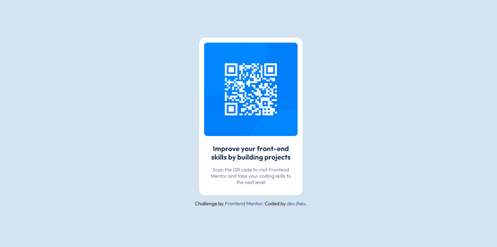

# Frontend Mentor - QR code component solution

This is a solution to the [QR code component challenge on Frontend Mentor](https://www.frontendmentor.io/challenges/qr-code-component-iux_sIO_H). Frontend Mentor challenges help you improve your coding skills by building realistic projects. 

## Table of contents

- [Overview](#overview)
  - [Screenshot](#screenshot)
  - [Links](#links)
- [My process](#my-process)
  - [Built with](#built-with)
  - [What I learned](#what-i-learned)
- [Author](#author)

## Overview

### Screenshot

### Links

- Live Site: [Live Site](https://qr-code-component-devjhex.vercel.app/)

## My process

### Built with

- Semantic HTML5 markup
- CSS custom properties
- Mobile-first workflow

### What I learned
I learned how to use sass in respect to organizing your files for big projects so as to make it simple and easy to access. For this project which was a little too small and unnecessary for that but I wanted to see the difference of clumping everything into one file and organizing everything.

## Author

- Frontend Mentor - [@Dev-Jhex](https://www.frontendmentor.io/profile/Dev-Jhex)
- Twitter - [@devJhex](https://www.twitter.com/devJhex)

